# UWC Macedonia Application Guide

Hi applicants!

This article serves to guide you through the application process for UWC Macedonia via the SurveyMonkey Application platform. Please make sure to familiarize yourself with the contents below as you're working on your application in order to avoid mistakes and uncertainties. For any questions or difficulties, feel free to email us at info@mk.uwc.org or contact us on Facebook ([UWC Macedonia](https://www.facebook.com/uwcmacedonia/)).

The deadline for submitting your application is **November 20, 2021 at 23:59**. 

Best of luck &mdash; we look forward to getting to know you better!

## Step 1: Registration

To start your process, click the following link to access the UWC Macedonia application:

[Link to application](https://apply.uwc.org/prog/uwc_macedonia_application_national_committee_selection "Click here")

Now, once you've read the introductory paragraphs, it it time to start the application. Firstly, you need to register a SurveyMonkey account &mdash; you can do this by clicking the green **Register** button in the top right corner. Fill out the form, and upon registration, you will receive a confirmation email with instructions, which you need to follow in order to **verify your email address**. Without verifying your email address, you cannot submit the application or perform certain tasks, so ensure you do it before taking any other steps.

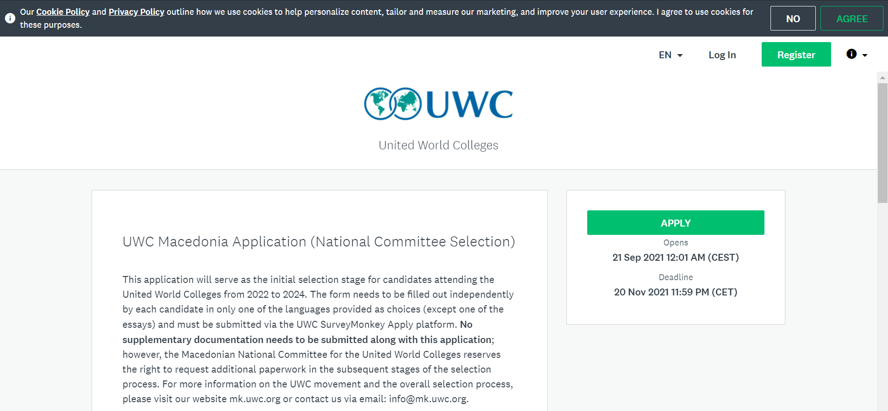

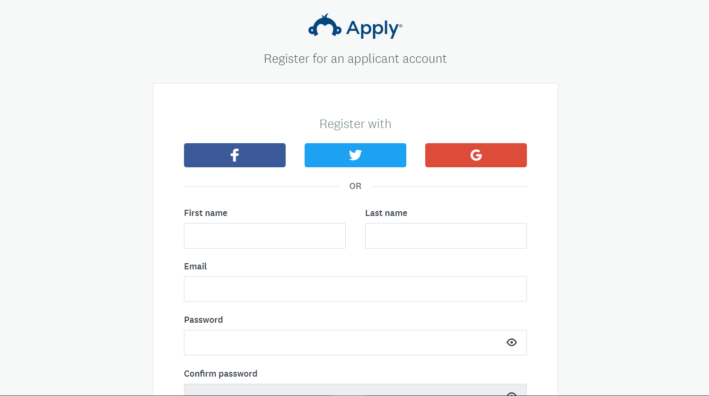

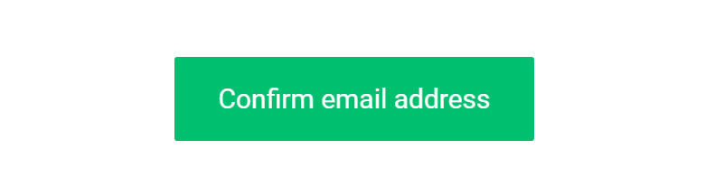

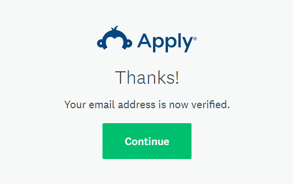

---

## Step 2: Eligibility Form

After your email verification is complete, you will be redirected to the page shown below. Click on the green **"View Programs"** box, and in the new page, click **"Fill out eligibility profile"**. This eligibility form is used by the system to verify which applications you can be considered for.

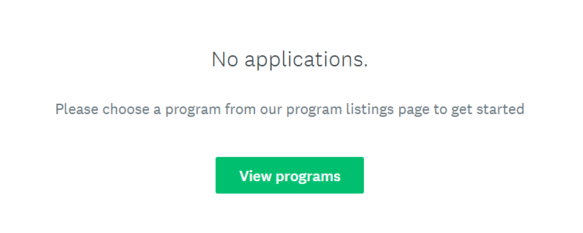

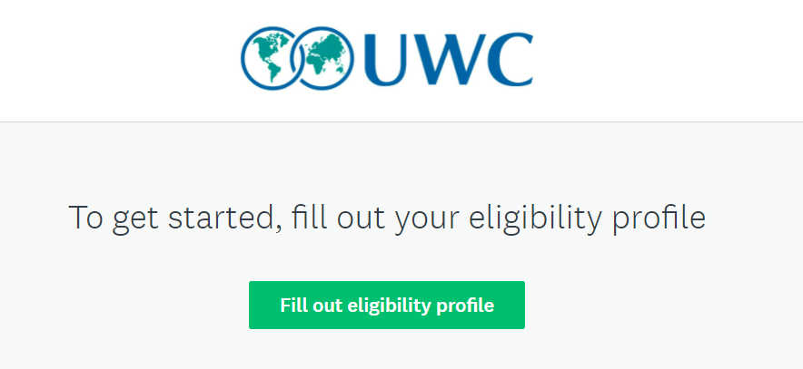

Start filling in the eligibility form with your **correct** personal information. It is extremely important that at least one of "Country of nationality" or "Country of residence" is set to Macedonia, as per your true status. Otherwise, the system will not consider you eligible for applying to UWC via the Macedonian National Committee, and you won't be able to access our application.

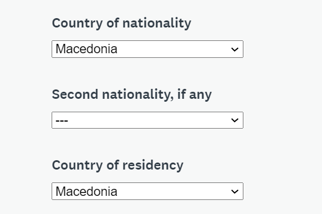

**Note**: If you hold a citizenship or residency in addition to your Macedonian, you might be eligible for applying via other National Committees. Whichever one you choose, you may only apply through that committee only.

Next, ensure to select the **UWC National Committee** option as the application route &mdash; the Global Selection Programme is a different process and not relevant here.

Lastly, read the *UWC Data Protection Policy* and the *UWC Privacy Statement*, and upon doing so, tick the corresponding boxes. Complete the eligibility form by clicking **"Save my Profile"**.

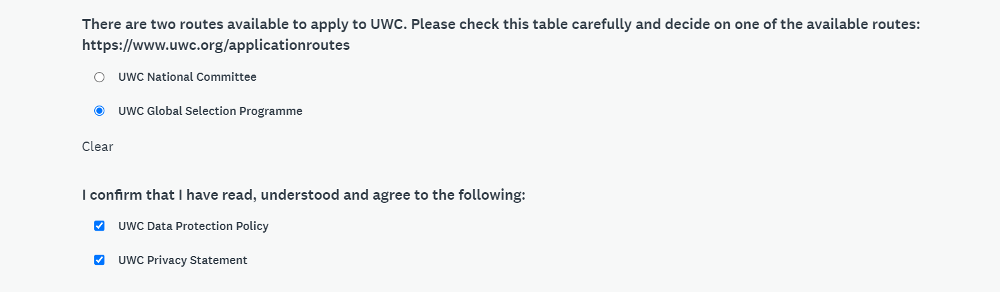

## Step 3: Begin application!

Now that you've completed step 2, and you are confirmed to be eligible, you will be redirected to the page shown in the image below. UWC Macedonia's application will be visible &mdash; click on **"More"**. 

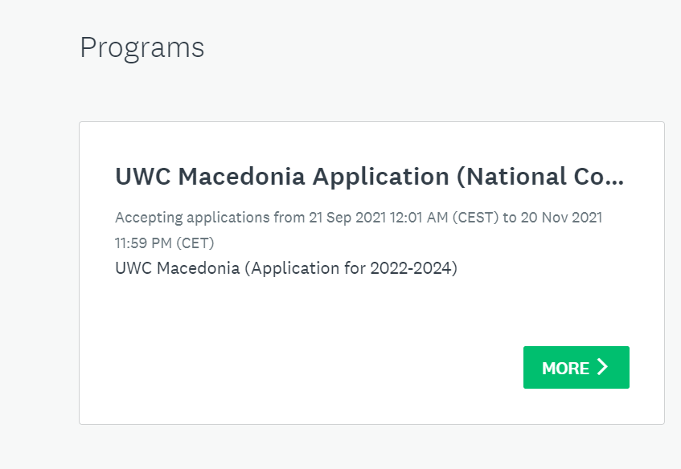

Once you are directed to the next page, make sure to carefully read the description and instructions. These will be important as you begin the actual application process. Then, click on **Apply**.

This will lead you to the page shown below. In it, there are two tasks for you to complete: Personal Information and Language Selection. Select the Personal Information section.

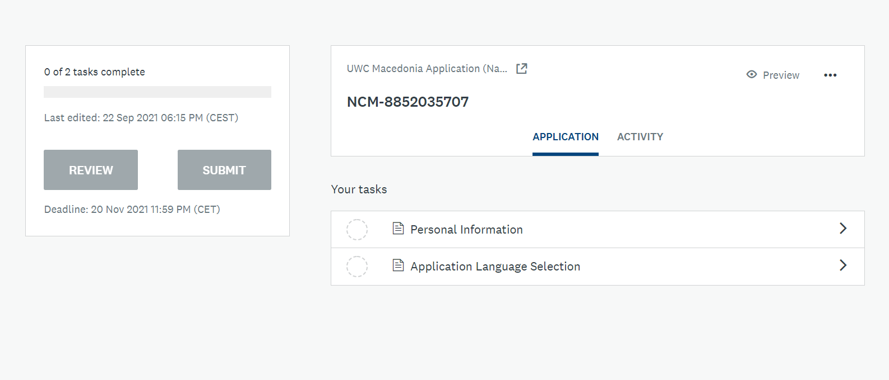

## Step 4: Personal Information

This section collects personal information. The information you enter in this section will be hidden from the evaluators of your application in order to ensure the process is fair and transparent. 

Make sure that the information you enter in this section is true to the best of your knowledge. After the grading of the application is complete, the personal information will be matched with the rest of the application. 

Once you finish this section and consent to the processing of the information you provided, click on **"Mark As Complete"**.

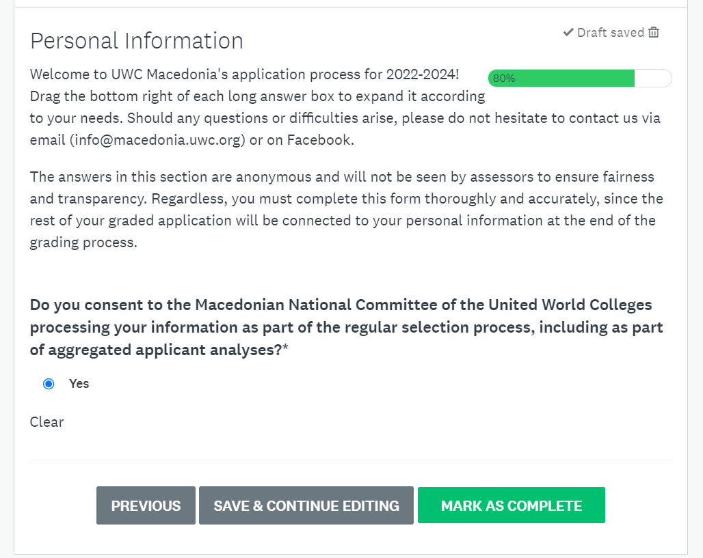

Now you can move on to the next section: Language Selection.

## Step 5: Language Selection

Here, you get to choose which language you want to fill in your actual application &mdash; such as answers to the short questions and essays. Thus, it is crucial that you choose the language that you are **most comfortable** with. Your choice of language <u>will not advantage or disadvantage your application whatsoever,</u> and has no effect on any part of the grading.

Based on your language selection, the application form in your chosen language will appear, and you are able to start with filling it in.

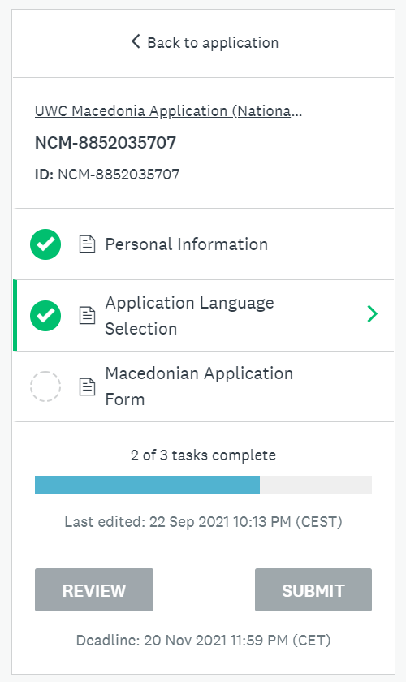

**Note**: if, at any point, you change your mind about which language you want to fill your application in, you are able to choose a new language and start over. To do this, click on the three dots on the top-right of the box, and click Reset. If you had already written answers in the existing application, we recommend downloading them before resetting the language in order to prevent losing them.

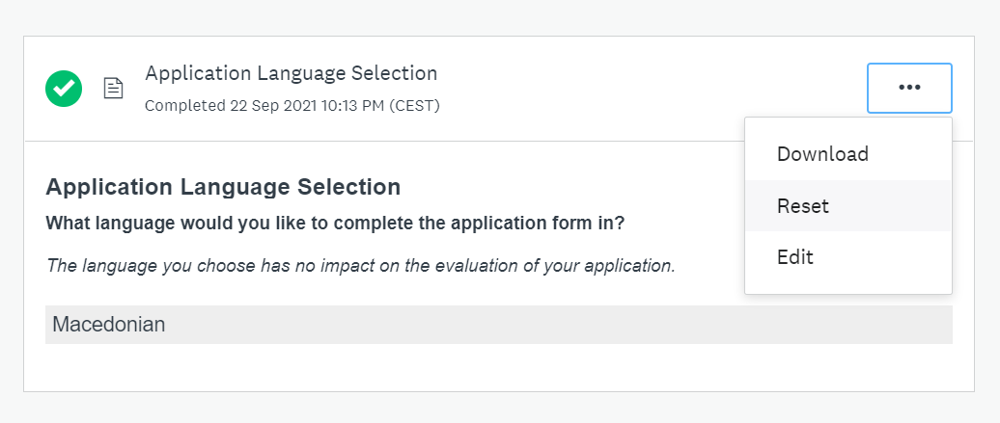

Once you are happy with your language choice, you may again click on the application form in the corresponding language, and start filling it out as before.

## Step 6: Apply in your chosen language

Finally, you've made it to the part where you get to tell us about yourself!

Start by reading all the included instructions, and filling in your answers in your selected language. This section has multiple parts, which you can navigate via the Previous and Next buttons. As you are completing questions, we recommend you frequently click on Save & Continue editing in order to prevent losing your responses if your browser crashes or internet connection stops.

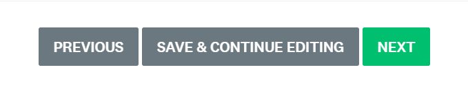

Note that in the Essay part of this section, one of the essays must be written in your native language (Macedonian/Albanian), and the other one in English. This is the only case in this section where you'll need to use a different language than your chosen one.

Once you have finished your answers and checked them, click on Mark as Complete at the end of the section. At this point, you will still be able to make changes to your answers as much as you need, as long as you haven't completed Step 8 (see below).

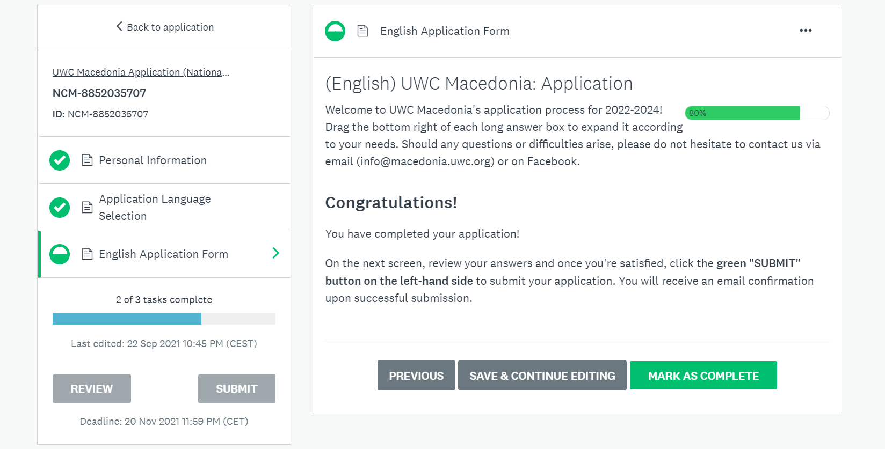

## Step 7: Review

Once all three sections (Personal Information, Language Selection and the Application Form) have been marked as complete, you will be able to review your application. Double-check your answers and your provided information. You are able go back to a specific section and make corrections if it is needed.

Finally, the review also gives you an opportunity to download all your answers &mdash; we advise you to do this for future reference.

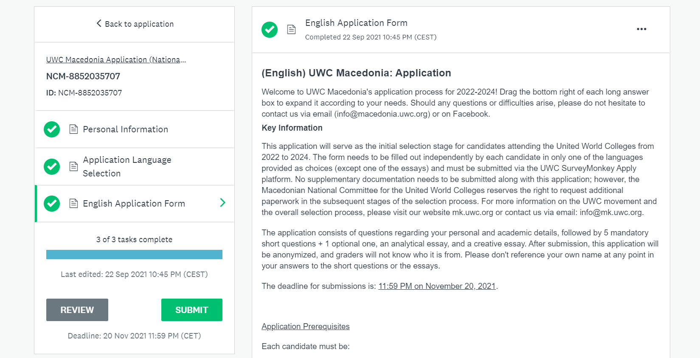

## Step 8: Submit

Once you have completed the review, and you are satisfied with everything, click  the green **Submit** button on the left-hand side. Once you confirm your decision by clicking the Submit button again, the system  submits the application to us for review. 

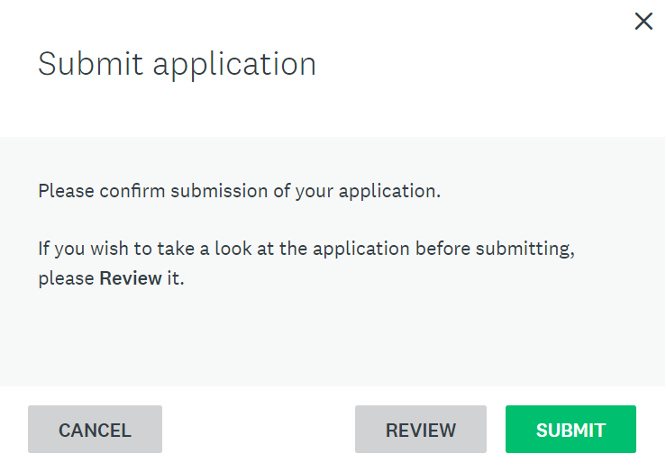

## Step 9: Check email

Upon successful submission of your application, you should receive a confirmation email. Make sure to check the inbox of the email address you entered in the forms (including the Spam/Junk folder). 

If you do not see a confirmation email anywhere, it might be possible that we have not received your application or a technical error has occurred. In this case, please contact us directly.

## 
